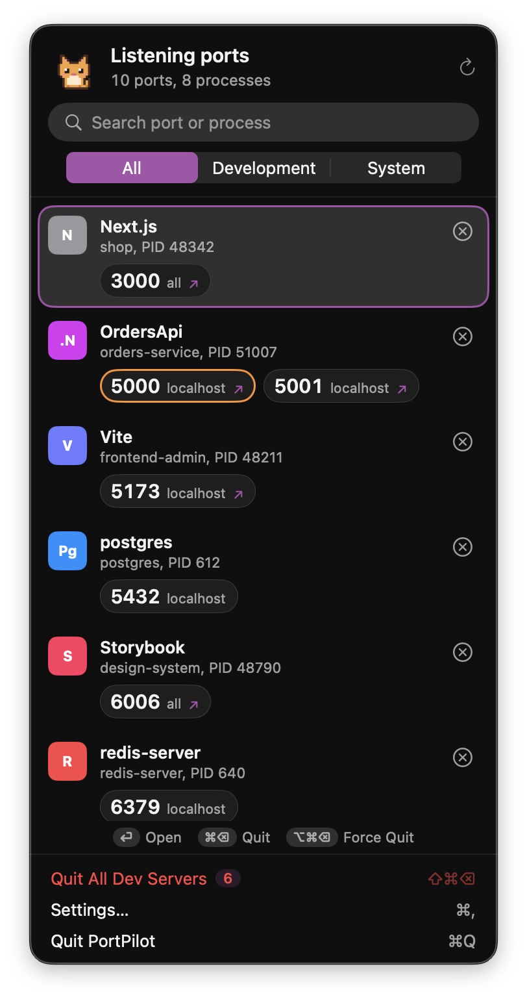

# PortPilot

A tiny native macOS menu bar app that shows every listening port, grouped by process — and lets you quit the dev server hogging `:3000` in one click.

<!-- TODO: replace with a real screenshot of the panel (light and dark) before announcing the release. -->


- **Grouped by process**: `Vite — frontend-admin`, `Next.js`, `service-scope (.NET)`, `postgres`, `Docker`… with the port numbers front and center.
- **Knows your stack**: detects Vite, Next.js, Nuxt, Astro, Storybook, Angular, NestJS, Django, Rails, Laravel, .NET, Docker and more, and shows the project folder the server was started from.
- **Quit safely**: SIGTERM first, Force Quit (SIGKILL) only if the process ignores it. System and app processes always ask first; processes of other users are shown locked and are never signalled.
- **Open in browser**: click a port chip to open `http://localhost:<port>`, right-click to copy.
- **Port clashes**: highlights ports bound by two processes (hello, AirPlay Receiver on 5000).
- **Keyboard first**: `↑`/`↓` select a row, `Return` opens it, `⌘⌫` quits it, `⌥⌘⌫` force quits it, `⇧⌘⌫` quits every dev server, `⌘F` searches, `⌘R` refreshes, `Esc` backs out (confirmation, search, panel). Type `3000` and hit `⌘⌫` to free a port.
- **Themes and mascots**: System, Synthwave, Terminal, Pastel, Sunset and Ocean, plus your own accent color. A pixel-art cat, penguin, fox, frog, bunny, panda, duck, owl, axolotl or capybara (or your own GIF) naps when nothing is running, cheers when a server quits and hops in the menu bar when servers start or stop.
- **Accessible**: VoiceOver labels on every row and button, text in system colors (Dark Mode and Increase Contrast just work; themes drop their tint with Increase Contrast), animations pause with Reduce Motion.
- English and Italian. Native SwiftUI, no dependencies, ~1 MB. macOS 13 Ventura or later.

## Install

Download the latest `.dmg` from [Releases](https://github.com/simiriva95/portpilot/releases), drag PortPilot to Applications and open it.

If a build is not notarized, macOS blocks the first launch. Right-click the app → **Open**, or run:

```sh
xattr -dr com.apple.quarantine /Applications/PortPilot.app
```

### Homebrew (coming soon)

A Homebrew cask is planned once the first notarized release is out. It will be:

```sh
brew install --cask portpilot
```

Until then, use the `.dmg` above.

## Build from source

Requires Xcode 15 or later (Swift 5.9+).

```sh
git clone https://github.com/simiriva95/portpilot.git
cd portpilot
swift run                     # debug run: menu bar icon, English strings only
swift test                    # unit tests for the scanner, detector and killer
./scripts/build-app.sh        # universal PortPilot.app + .zip + .dmg in ./dist
```

`swift run` starts the bare executable, so translations and the app icon only appear in the `.app` built by `build-app.sh`. Open `Package.swift` in Xcode to work on it with previews and the debugger.

## How it works

PortPilot runs `lsof -nP -iTCP -sTCP:LISTEN` (plus `-iUDP` if enabled) and `netstat -anv -p tcp`, which also sees sockets of other users without root. For each process it reads the executable path, arguments and working directory via `sysctl(KERN_PROCARGS2)` and `proc_pidinfo`, and classifies it as a dev server, an app or a system process. Quitting uses `kill(2)`, only for processes you own. Nothing leaves your Mac.

The app can't be sandboxed (it needs to see and signal other processes), so it's distributed outside the Mac App Store.

## Contributing

Issues and pull requests are welcome.

- Keep it dependency-free and native: SwiftUI, AppKit and Foundation only.
- Non-UI logic lives in `Sources/PortPilotCore` and should come with a test in `Tests/PortPilotTests`. Framework detection is table-driven in `DevDetector.swift`: adding a stack is usually a one-line change plus a test case.
- Outside the theme presets in `Theme.swift`, use system semantic colors, never hex values, so appearance and accessibility settings keep working.
- UI strings go in `Resources/Localizable.xcstrings` (English and Italian). New languages are welcome.
- The app icon is generated from `Resources/AppIcon.svg` with `./scripts/make-icon.sh`, the mascot GIFs from the ASCII sprites in `scripts/make-gifs.swift` (`swift scripts/make-gifs.swift preview.png` also writes a contact sheet). New animals welcome.
- Theme text stays in semantic colors; a theme only sets the accent, the background wash and the icon palette.
- Run `swift build` and `swift test` before opening a PR, and use [Conventional Commits](https://www.conventionalcommits.org) (`feat:`, `fix:`, `docs:`…).

## Releasing

Update `CHANGELOG.md`, then push a tag like `v0.1.0`. The Release workflow runs the tests, builds a universal binary and attaches the `.dmg` and `.zip` to a GitHub release.
To sign and notarize, add these repository secrets: `MACOS_CERT_P12` (base64 Developer ID Application certificate), `MACOS_CERT_PASSWORD`, `APPLE_ID`, `APPLE_TEAM_ID`, `APPLE_APP_PASSWORD` (app-specific password).

## License

MIT
