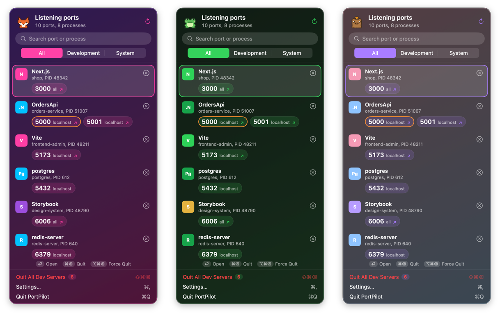

# PortPilot

A tiny native macOS menu bar app that shows every listening port, grouped by process — and lets you quit the dev server hogging `:3000` in one click.

<p align="center">
  
</p>

- **Grouped by process**: `Vite — frontend-admin`, `Next.js`, `service-scope (.NET)`, `postgres`, `Docker`… with the port numbers front and center.
- **Knows your stack**: detects Vite, Next.js, Nuxt, Astro, Storybook, Angular, NestJS, Django, Rails, Laravel, .NET, Docker and more, and shows the project folder the server was started from.
- **Quit safely**: SIGTERM first, Force Quit (SIGKILL) only if the process ignores it. System and app processes always ask first; processes of other users are shown locked and are never signalled.
- **Open in browser**: click a port chip to open `http://localhost:<port>`, right-click to copy.
- **Port clashes**: highlights ports bound by two processes (hello, AirPlay Receiver on 5000).
- **Keyboard first**: `↑`/`↓` select a row, `Return` opens it, `⌘⌫` quits it, `⌥⌘⌫` force quits it, `⇧⌘⌫` quits every dev server, `⌘F` searches, `⌘R` refreshes, `Esc` backs out (confirmation, search, panel). Type `3000` and hit `⌘⌫` to free a port.
- **Themes and mascots**: System, Synthwave, Terminal, Pastel, Sunset and Ocean, plus your own accent color. A pixel-art cat, penguin, fox, frog, bunny, panda, duck, owl, axolotl, capybara, dino, hedgehog or octopus (or your own GIF) naps when nothing is running, cheers when a server quits and hops in the menu bar when servers start or stop.
- **Accessible**: VoiceOver labels on every row and button, text in system colors (Dark Mode and Increase Contrast just work; themes drop their tint with Increase Contrast), animations pause with Reduce Motion.
- English and Italian. Native SwiftUI, no dependencies, ~1 MB. macOS 13 Ventura or later.

<p align="center">
  
</p>

## Install

1. Download `PortPilot-<version>.dmg` from [Releases](https://github.com/simiriva95/portpilot/releases).
2. Open it and drag **PortPilot** to **Applications**.
3. Sign it on your Mac (once per download, see below), then open it. The icon appears in the menu bar.

### Sign it yourself

PortPilot is free and open source, and it isn't signed with an Apple Developer ID. The first time you open it, macOS stops it with *"PortPilot is damaged and can't be opened"* or *"Apple could not verify PortPilot is free of malware"*. That message is about the missing Apple signature, not about the app.

Fix it once in Terminal:

```sh
# 1. Remove the "downloaded from the internet" flag that triggers the block
xattr -dr com.apple.quarantine /Applications/PortPilot.app

# 2. Re-sign the app with a local (ad-hoc) signature made by your Mac
codesign --force --deep --sign - /Applications/PortPilot.app

# 3. Check the signature, then open it
codesign --verify --deep --strict --verbose=2 /Applications/PortPilot.app
open /Applications/PortPilot.app
```

Step 3 should print `valid on disk` and `satisfies its Designated Requirement`. The `-` in step 2 means "ad-hoc": the signature is made on your Mac and trusted only there, which is what macOS needs to run an app that isn't from an identified developer.

**Without Terminal:** open PortPilot once so macOS blocks it, then go to **System Settings → Privacy & Security**, scroll down to the message about PortPilot and click **Open Anyway**. On macOS 15 Sequoia and later, right-click → Open no longer skips the check, so use this or the commands above.

**Updates:** repeat the steps after installing a new version. If **Launch at login** stops working after an update, turn it off and on again in PortPilot's Settings.

**Verify the download (optional):** each release lists SHA-256 checksums in `SHA256SUMS.txt`. Compare them before removing the quarantine flag:

```sh
shasum -a 256 ~/Downloads/PortPilot-*.dmg
```

Prefer not to run a downloaded binary at all? [Build it from source](#build-from-source): it takes about a minute and needs no signing.

### Homebrew (coming soon)

A Homebrew cask is planned. It will be:

```sh
brew install --cask portpilot
```

Until then, use the `.dmg` above.

## Build from source

Requires Xcode 15 or later (Swift 5.9+).

```sh
git clone https://github.com/simiriva95/portpilot.git
cd portpilot
swift run                     # debug run: menu bar icon, English strings only
swift test                    # unit tests for the scanner, detector and killer
./scripts/build-app.sh        # universal PortPilot.app + .zip + .dmg in ./dist
```

`swift run` starts the bare executable, so translations and the app icon only appear in the `.app` built by `build-app.sh`. Open `Package.swift` in Xcode to work on it with previews and the debugger.

## How it works

PortPilot runs `lsof -nP -iTCP -sTCP:LISTEN` (plus `-iUDP` if enabled) and `netstat -anv -p tcp`, which also sees sockets of other users without root. For each process it reads the executable path, arguments and working directory via `sysctl(KERN_PROCARGS2)` and `proc_pidinfo`, and classifies it as a dev server, an app or a system process. Quitting uses `kill(2)`, only for processes you own. Nothing leaves your Mac.

The app can't be sandboxed (it needs to see and signal other processes), so it's distributed outside the Mac App Store.

## Contributing

Issues and pull requests are welcome.

- Keep it dependency-free and native: SwiftUI, AppKit and Foundation only.
- Non-UI logic lives in `Sources/PortPilotCore` and should come with a test in `Tests/PortPilotTests`. Framework detection is table-driven in `DevDetector.swift`: adding a stack is usually a one-line change plus a test case.
- Outside the theme presets in `Theme.swift`, use system semantic colors, never hex values, so appearance and accessibility settings keep working.
- UI strings go in `Resources/Localizable.xcstrings` (English and Italian). New languages are welcome.
- The app icon is generated from `Resources/AppIcon.svg` with `./scripts/make-icon.sh`, the mascot GIFs from the ASCII sprites in `scripts/make-gifs.swift` (`swift scripts/make-gifs.swift preview.png` also writes a contact sheet). New animals welcome.
- Theme text stays in semantic colors; a theme only sets the accent, the background wash and the icon palette.
- For screenshots, run with fake processes: `open dist/PortPilot.app --args -demo YES -theme synthwave -mascot fox`. In demo mode quitting only removes the row, nothing is signalled.
- Run `swift build` and `swift test` before opening a PR, and use [Conventional Commits](https://www.conventionalcommits.org) (`feat:`, `fix:`, `docs:`…).

## Releasing

Update `CHANGELOG.md`, then push a tag like `v0.1.0`. The Release workflow runs the tests, builds a universal binary and attaches the `.dmg` and `.zip` to a GitHub release.
To sign and notarize, add these repository secrets: `MACOS_CERT_P12` (base64 Developer ID Application certificate), `MACOS_CERT_PASSWORD`, `APPLE_ID`, `APPLE_TEAM_ID`, `APPLE_APP_PASSWORD` (app-specific password).

## License

MIT
